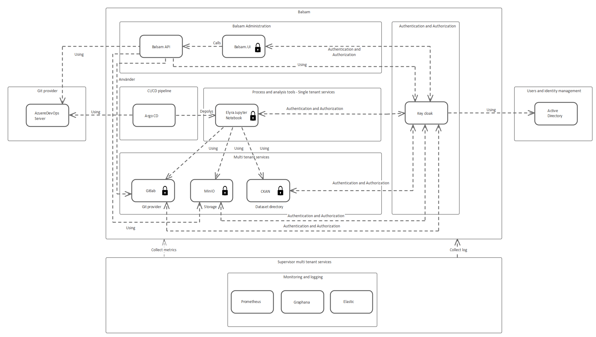

# BALSAM (Base platform for data processing and analysis)

## Description

The rapid digitalisation of society means that the data ecosystem is continuously expanded with new data sources. In order to process and analyze these, new data hubs are needed that provide support for ensuring that processing of data can be done in a secure and quality-assured way and at the same time enables several actors to collaborate within the data lab. By building on well-established, open initiatives, the project will deliver a base platform for processing and analysis that can be used as a template to quickly establish new data labs.

This projekt is co-funded by VINNOVA and is a co-venture with ORU, AI Sweden and Statistics Sweden.

- [Vinova projekts](https://www.vinnova.se/p/basplattform-for-databearbetning-och-analys/)
- [AI Sweden](https://www.ai.se/en)
- [Örebro Universitet](https://www.oru.se/)
- [Statistics Sweden](https://www.scb.se)

## Technical overview

The platform for dataprocessing is composed by the folowing components.



## Quickguide to run demo

1. Install Kubernetes
[read more](https://microk8s.io/docs/addon-hostpath-storage)

```code
  sudo apt install snapd 
  
  sudo snap install microk8s --classic

  # Verify that kubernetes is running
  microk8s kubectl get pod -A
 ```

 2. Enable local persistan storage

 ``` 
  microk8s enable hostpath-storage
```

2. Install ArgoCD and namespace

```code
  microk8s kubectl create namespace argocd
  
  microk8s kubectl apply -n argocd -f https://raw.githubusercontent.com/argoproj/argo-cd/stable/manifests/install.yaml 
```

To be continued...

## Documentation

Documentation and installation instructions can be found [here](docs/readme.md).
